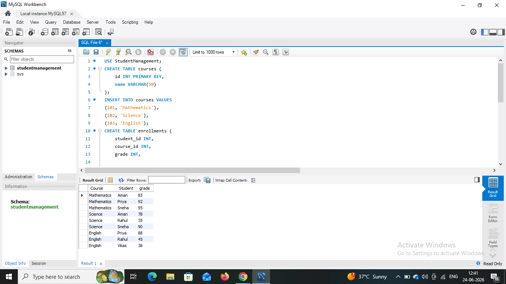
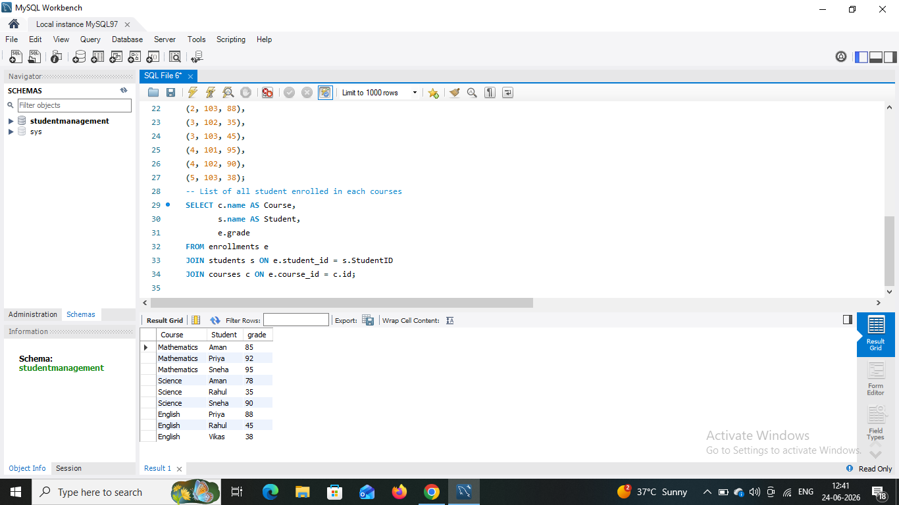
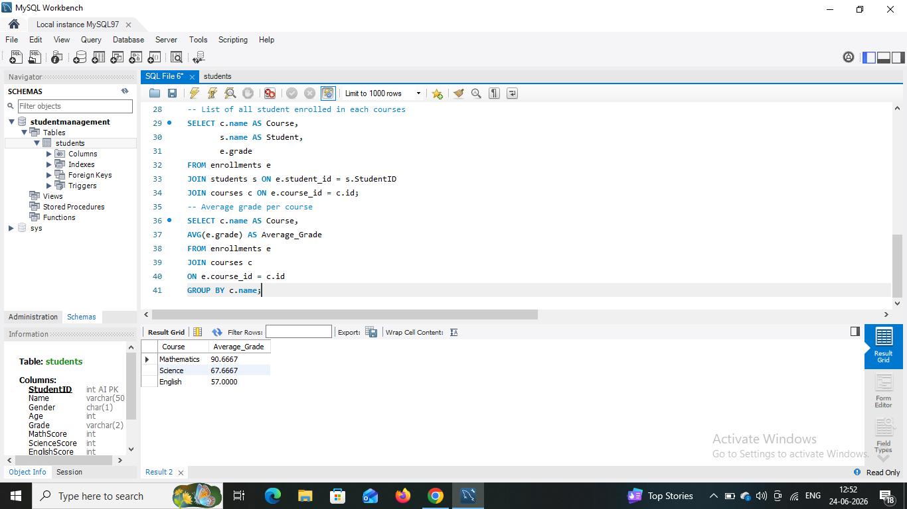
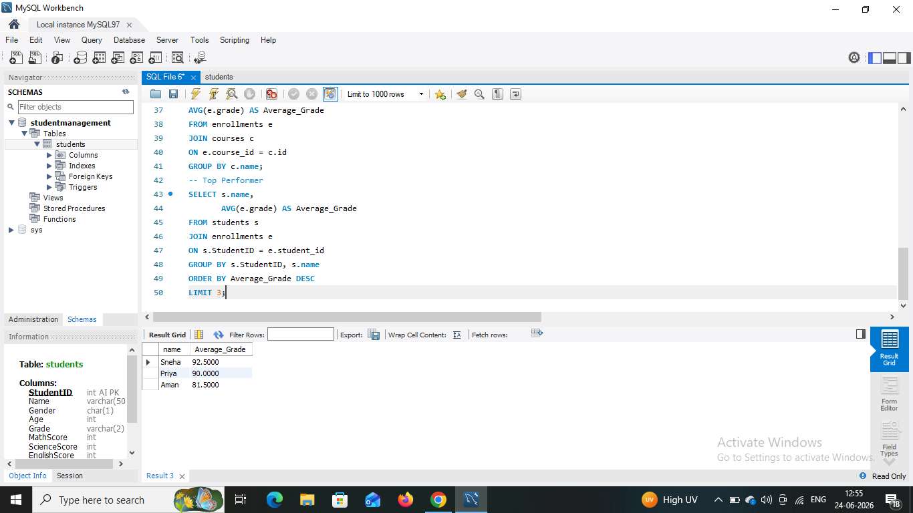

# SQL Data Analysis Internship - Task 2
## 📌 Project Overview
This project extends the Student Management Database by adding **Courses** and **Enrollments** tables. The task focuses on understanding table relationships, joins, aggregations, and analytical SQL queries.

---
## 🛠️ Tools Used
- MySQL Workbench
- GitHub
---
## 📂 Database Tables
### 1. Students Table
Contains student information.
### 2. Courses Table
```sql
CREATE TABLE courses (
    id INT PRIMARY KEY,
    name VARCHAR(50)
);
```
### 3. Enrollments Table
```sql
CREATE TABLE enrollments (
    student_id INT,
    course_id INT,
    grade INT,

    FOREIGN KEY (student_id) REFERENCES students(id),
    FOREIGN KEY (course_id) REFERENCES courses(id)
);
```
---
## Table creation 

## 📊 SQL Queries and Results

### 1️⃣ List all students enrolled in each course
```sql
SELECT c.name AS Course,
       s.name AS Student,
       e.grade
FROM enrollments e
JOIN students s
ON e.student_id = s.id
JOIN courses c
ON e.course_id = c.id;
```
### Output

---
### 2️⃣ Find average grade per course

```sql
SELECT c.name AS Course,
       AVG(e.grade) AS Average_Grade
FROM enrollments e
JOIN courses c
ON e.course_id = c.id
GROUP BY c.name;
```
### Output

---
### 3️⃣ Find Top 3 Students Overall
```sql
SELECT s.name,
       AVG(e.grade) AS Average_Grade
FROM students s
JOIN enrollments e
ON s.id = e.student_id
GROUP BY s.id, s.name
ORDER BY Average_Grade DESC
LIMIT 3;
```
### Output

---
### 4️⃣ Count students who failed (grade < 40)
```sql
SELECT COUNT(DISTINCT student_id) AS Failed_Students
FROM enrollments
WHERE grade < 40;
```
### Output

---
## 🔑 SQL Concepts Used
- INNER JOIN
- GROUP BY
- Aggregate Functions (`AVG`, `COUNT`)
- ORDER BY
- LIMIT
- Foreign Keys
---
## 🎯 Learning Outcomes
- Understood relational database concepts.
- Practiced SQL joins and aggregations.
- Analyzed student performance using SQL queries.
- Improved data analysis skills using MySQL.
---
## 👩‍💻 Author
**Kriti Gupta**
